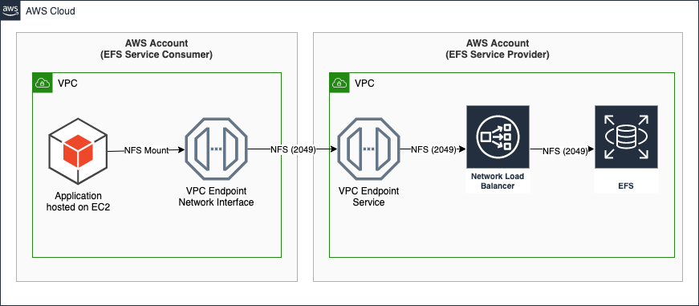

# AWS VPC Endpoint Service for EFS

`NOTICE: This project is an example and not intended for production deployments.`

This AWS CloudFormation shows how to make EFS accessible to another account using VPC Endpoint Services.

### Instructions

1. The template should be deployed in the AWS account managing the EFS volume. You will need to provide the following 
   as inputs:
   - Account Number for the AWS account that will use the EFS volume.
   - VPC ID where the EFS volume will be deployed to
   - VPC Subnets for the EFS mount targets.
   - VPC CIDR Range, used to restrict access to the EFS volume
2. When the template is deployed, the AWS CloudFormation Outputs shows the `service name` of the VPC Endpoint Service. 
  Provide this service name to the consumer account. 
3. In the consumer account, create a new VPC Endpoint, using the `service name`.
   Specify a Security Group that allows ingress to port 2049.
   The consumer must wait for acceptance.
4. In the service account, accept the connection request. It may take a few minutes for the consumer to see
   the acceptance.
5. In the consumer account, the VPC Endpoint connection is now established.
   The VPC Endpoint will have a DNS name that clients can use to mount the volume.
   You need to use a mount command like:
   
   `sudo mount -t nfs4 -o nfsvers=4.1,rsize=1048576,wsize=1048576,hard,timeo=600,retrans=2,noresvport VPC_ENDPOINT_DNS_NAME:/ efs`

   Make sure to replace `VPC_ENDPOINT_DNS_NAME`

### Optimizations

- **Availability** - this example demonstrates deployment of EFS and the NLB to two Availability Zones. 
For production, you may want to deploy to three or more Availability Zones.
- **EFS Performance** - the EFS volume is configured to use the default settings. You may need to adjust the throughput and mode of the volume
for your use case.
- **Network Load Balancer / Cross Zone Load Balancing** - you may want to review this setting and adapt.
- **Network Load Balancer / Sticky Sessions** - you may want/need to enable sticky sessions based on source ip address.
